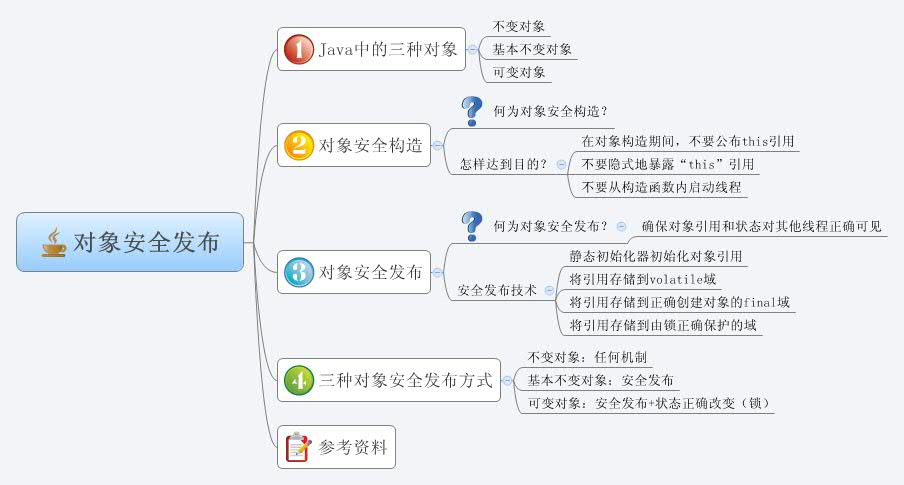

#DCL(Double Check Lock)之对象安全发布

##对象安全发布

发布（publish）一个对象：使对象能够在当前作用域之外的代码中使用
安全发布：确保对象引用和状态对其他线程正确可见



##DCL

臭名昭著的双重锁检查（也叫多线程单例模式）是一个骗人的把戏，它用来支持lazy初始化，同时避免过度使用同步。

双重锁检查代码如下：

```java
private static Something instance = null;

public Something getInstance() {
  if (instance == null) {
    synchronized (this) {
      if (instance == null)
        instance = new Something();
    }
  }
  return instance;
}
```

实际上，它并不能正常工作。

原因：初始化实例操作 new Something()和实例字段的写入操作 instance = XXX 可能按顺序进行，也可能颠倒。因此一个线程调用getInstance()时能得到一个非空的对象引用，但是得到的对象引用不能保证是实例初始化好的。

解决办法1：将Instance变为不可变对象，比如所有字段都是final.

解决办法2：使用volatile关键字
JSR-133定义新的JMM中增强了volatile的语义
新的语义：
	*不允许对一个volatile的写操作与之前的读写操作进行重排。（写之前）
	*对volatile的读操作也不会与后续的读写进行重排。（读之后）

例子A：

```java
class T {
    private static volatile T instance;
    public M m; // 这里没有final修饰
 
    public static T getInstance() {
        if (null == instance) {
            synchronized (T.class) {
                if (null == instance) {
                    instance = new T();
                    instance.m = new M();
                }
            }
        }
        return instance;
    }
}
```

例子B：

```java
class T {
    private static volatile T instance;
    public M m; // 这里没有final修饰
 
    public static T getInstance() {
        if (null == instance) {
            synchronized (T.class) {
                if (null == instance) {
                    T temp = new T();
                    temp.m = new M();
                    instance = temp;
                }
            }
        }
        return instance;
    }
}
```

A和B哪个可以安全发布对象？

A不能： 当一个线程执行完第一句`instance = new T();`时，对象已经非空，这时如果另一个线程调用getInstance()就会得到一个没有来得及初始化m字段的不完整的对象。
volatile可以保证`new T()` happens before `instance = new T()` 但是不能保证线程X中给instance的属性赋的值new M()能被线程Y看到。

B能： 代码B所有对于实例初始化的操作都放 `instance=temp;` （即对volatile修饰的属性instance的写操作）之前，这些操作的结果都是“可见的”。

##使用双重锁检查来实现单例模式不是一个好的选择。

DCL的初衷是为了避免过度使用同步导致性能问题。在新的JMM中，使用volatile有一定性能开销（屏蔽一些重排序优化）。

使用IODH(Initialization On Demand Holder)来实现多线程模式下的单例会更易读：

```java
class T {
    public final M m = new M();
	
	//加一个static内部类
    private static class LazyHolder {
        public static T instance = new T();
    }
 
    public static T getInstance() {
        return LazyHolder.instance;
    }
}
```

这段代码是正确的，因为初始化是由static字段来保证的。
如果一个字段设置在static初始化中，对其他访问这个类的线程来说是是能正确的保证它的可见性的。


