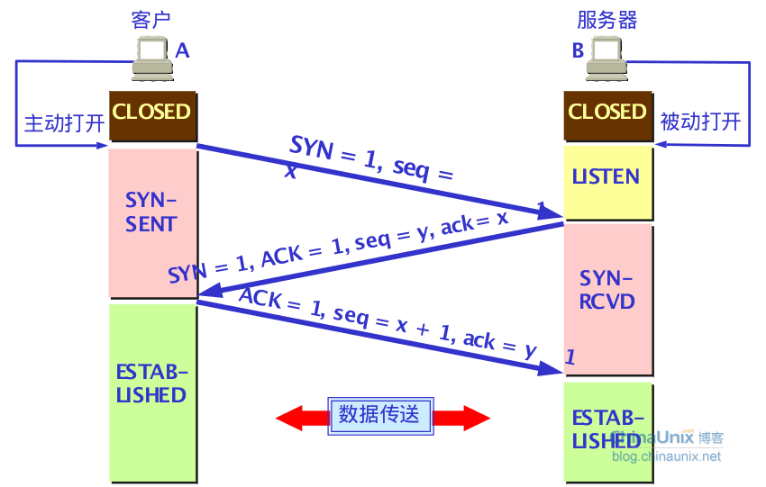
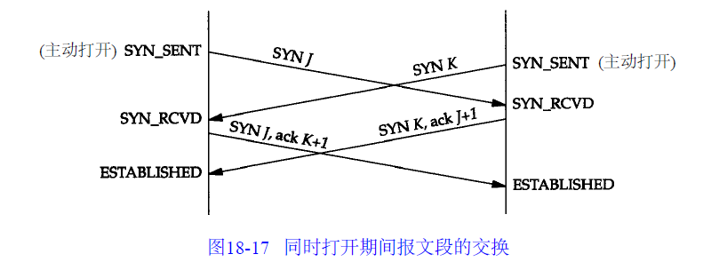

#计算机网络面试题

##当你在浏览器中输入一个URL之后,都发生了什么?

1.浏览器请求DNS服务器,找到URL对应的IP地址

2.DNS负责管理域名和它映射的IP地址,分布式的树形结构,由他返回URL对应的IP地址,DNS是分布式的,一起工作,一台找不到,就把请求发给其他的DNS.

3.浏览器在80端口打开一个到此网站web服务器的TCP连接

4.向服务器发送请求,服务器完成处理,返回响应

5.浏览器获取响应的HTML代码

6.浏览器在自己的显示区域渲染HTML

##常用的路由协议有哪些?

* BGP:边界网关协议,用于不同自治系统的路由器之间交换路由信息.RIP和OSPF都是在同一个自治系统内进行路由信息交换

* OSPF:开放最短路径优先.向本区域的所有路由器发送信息,不只是相邻的.发送的信息是本身和相邻路由器的链路状态.只有当链路状态变化时才发送信息.`不用UDP,直接用IP数据报传送`

* RIP:基于距离向量.工作原理是靠一张路由信息表(存储本路由器知道的所有到目的网络的最快路由,包括到某个网络的跳数,下一跳路由器地址). 通过和相邻的路由器交换信息,这张表持续更新.`使用UDP进行传送`

##TCP三次握手,四次挥手

* 对于建链接的3次握手:主要是要初始化Sequence Number 的初始值。通信的双方要互相通知对方自己的初始化的Sequence Number（缩写为ISN：Inital Sequence Number）——所以叫SYN，全称Synchronize Sequence Numbers。也就上图中的 x 和 y。这个号要作为以后的数据通信的序号，以保证应用层接收到的数据不会因为网络上的传输的问题而乱序（TCP会用这个序号来拼接数据）。

三次握手图:

同时打开TCP链接如下图:

* 对于4次挥手:其实你仔细看是2次，因为TCP是全双工的，所以，发送方和接收方都需要Fin和Ack。只不过，有一方是被动的，所以看上去就成了所谓的4次挥手。如果两边同时断连接，那就会就进入到CLOSING状态，然后到达TIME_WAIT状态。下图是双方同时断连接的示意图（你同样可以对照着TCP状态机看）：

##TCP的有限状态机

##TCP其他问题

http://coolshell.cn/articles/11564.html

